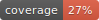

# todoist_quick_capture

<div align="center">

[](https://github.com/crypdick/todoist_quick_capture/actions?query=workflow%3Abuild)
[](https://pypi.org/project/todoist_quick_capture/)
[](https://github.com/crypdick/todoist_quick_capture/pulls?utf8=%E2%9C%93&q=is%3Apr%20author%3Aapp%2Fdependabot)

[](https://github.com/astral-sh/ruff)
[](https://github.com/PyCQA/bandit)
[](https://github.com/crypdick/todoist_quick_capture/blob/main/.pre-commit-config.yaml)
[](https://github.com/crypdick/todoist_quick_capture/releases)
[](https://github.com/crypdick/todoist_quick_capture/blob/main/LICENSE)


Todoist does not support a quick capture command on Linux. This package is a simple GUI to quickly capture tasks and send them to Todoist, e.g. "Buy milk tom 5pm p1 #grocery @shopping".

Note that duration and reminders are not yet supported by the Todoist API, e.g. "Read book 5p for 40m !1hb". The task will get created with the duration and reminder text in the title without being parsed.

</div>

## Installation locally

Conda package manager is recommended. Create a conda environment.

```bash
conda create -n todoist_quick_capture python==3.10
```

Activate conda environment and install poetry

```bash
conda activate todoist_quick_capture
pip install poetry
```

## Running the app using python

```bash
python app.py
```

## Running from CLI

You can run the client using the following command:

```bash
todoist_quick_capture --help
```

or with `Poetry`:

```bash
poetry run todoist_quick_capture --help
```

### Makefile usage

[`Makefile`](https://github.com/crypdick/todoist_quick_capture/blob/main/Makefile) contains a lot of functions for faster development.


<details>
<summary>1. Install all dependencies and pre-commit hooks</summary>
<p>

Install requirements:

```bash
make install
```

Pre-commit hooks coulb be installed after `git init` via

```bash
make pre-commit-install
```

</p>
</details>

<details>
<summary>2. Codestyle and type checks</summary>
<p>

Automatic formatting uses `ruff`.

```bash
make polish-codestyle

# or use synonym
make formatting
```

Codestyle checks only, without rewriting files:

```bash
make check-codestyle
```

> Note: `check-codestyle` uses `ruff` and `darglint` library

</p>
</details>

<details>
<summary>3. Code security</summary>
<p>

> If this command is not selected during installation, it cannnot be used.

```bash
make check-safety
```

This command launches `Poetry` integrity checks as well as identifies security issues with `Safety` and `Bandit`.

```bash
make check-safety
```

</p>
</details>

<details>
<summary>4. Tests with coverage badges</summary>
<p>

Run `pytest`

```bash
make test
```

</p>
</details>

<details>
<summary>5. All linters</summary>
<p>

Of course there is a command to run all linters in one:

```bash
make lint
```

the same as:

```bash
make check-codestyle && make test && make check-safety
```

</p>
</details>

<details>
<summary>6. Docker</summary>
<p>

```bash
make docker-build
```

which is equivalent to:

```bash
make docker-build VERSION=latest
```

Remove docker image with

```bash
make docker-remove
```

More information [about docker](https://github.com/Undertone0809/python-package-template/tree/main/%7B%7B%20cookiecutter.project_name%20%7D%7D/docker).

</p>
</details>

<details>
<summary>7. Cleanup</summary>
<p>
Delete pycache files

```bash
make pycache-remove
```

Remove package build

```bash
make build-remove
```

Delete .DS_STORE files

```bash
make dsstore-remove
```

Remove .mypycache

```bash
make mypycache-remove
```

Or to remove all above run:

```bash
make cleanup
```

</p>
</details>

## 📈 Releases

You can see the list of available releases on the [GitHub Releases](https://github.com/crypdick/todoist_quick_capture/releases) page.

We follow [Semantic Versions](https://semver.org/) specification.

We use [`Release Drafter`](https://github.com/marketplace/actions/release-drafter). As pull requests are merged, a draft release is kept up-to-date listing the changes, ready to publish when you’re ready. With the categories option, you can categorize pull requests in release notes using labels.

### List of labels and corresponding titles

|               **Label**               |  **Title in Releases**  |
| :-----------------------------------: | :---------------------: |
|       `enhancement`, `feature`        |       🚀 Features       |
| `bug`, `refactoring`, `bugfix`, `fix` | 🔧 Fixes & Refactoring  |
|       `build`, `ci`, `testing`        | 📦 Build System & CI/CD |
|              `breaking`               |   💥 Breaking Changes   |
|            `documentation`            |    📝 Documentation     |
|            `dependencies`             | ⬆️ Dependencies updates |

You can update it in [`release-drafter.yml`](https://github.com/crypdick/todoist_quick_capture/blob/main/.github/release-drafter.yml).

GitHub creates the `bug`, `enhancement`, and `documentation` labels for you. Dependabot creates the `dependencies` label. Create the remaining labels on the Issues tab of your GitHub repository, when you need them.

## 🛡 License

[](https://github.com/crypdick/todoist_quick_capture/blob/main/LICENSE)

This project is licensed under the terms of the `MIT` license. See [LICENSE](https://github.com/crypdick/todoist_quick_capture/blob/main/LICENSE) for more details.

## 📃 Citation

```bibtex
@misc{todoist_quick_capture,
  author = {todoist_quick_capture},
  title = {Awesome `todoist_quick_capture` is a Python cli/package created with https://github.com/Undertone0809/python-package-template},
  year = {2024},
  publisher = {GitHub},
  journal = {GitHub repository},
  howpublished = {\url{https://github.com/crypdick/todoist_quick_capture}}
}
```

## Credits [](https://github.com/Undertone0809/python-package-template)

This project was generated with [`python-package-template`](https://github.com/Undertone0809/python-package-template)
